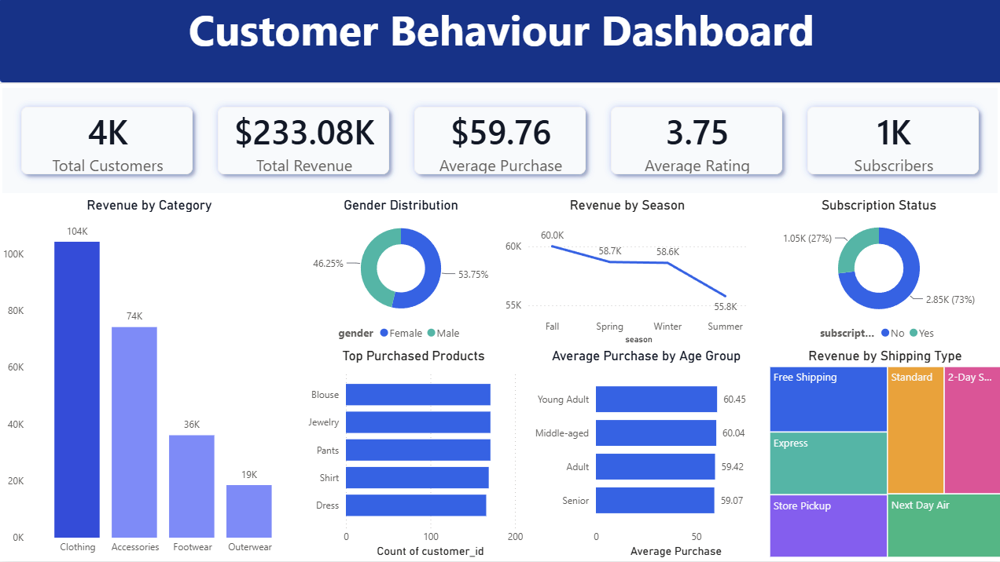

# 📊 Customer Shopping Trends Analysis

An end-to-end Data Analytics project that analyzes customer shopping behavior using **Python, SQL, and Power BI**. The project transforms raw retail customer data into meaningful business insights through data cleaning, SQL-based analysis, and an interactive Power BI dashboard.

---

# 📊 Dashboard Preview



---

# 📌 Project Overview

This project focuses on understanding customer purchasing behavior by analyzing demographic information, product preferences, purchasing patterns, subscription status, payment methods, and seasonal sales trends.

The workflow covers the complete analytics lifecycle:

- Data Cleaning using Python
- Exploratory Data Analysis (EDA)
- Business Analysis using SQL
- Interactive Dashboard Development in Power BI
- Business Insight Generation

---

# 🎯 Business Objective

The objective of this project is to help businesses make data-driven decisions by answering questions such as:

- Which product categories generate the highest revenue?
- Which customer groups spend the most?
- How do subscriptions affect customer purchasing behavior?
- Which payment methods and shipping options are preferred?
- How do sales vary across different seasons?

---

# 📂 Dataset Information

The dataset contains shopping information for approximately **3,900 customers** with **18 attributes**, including:

- Customer ID
- Age
- Gender
- Item Purchased
- Category
- Purchase Amount (USD)
- Location
- Size
- Color
- Season
- Review Rating
- Subscription Status
- Shipping Type
- Discount Applied
- Promo Code Used
- Previous Purchases
- Payment Method
- Frequency of Purchases

---

# 🛠️ Tech Stack

| Technology | Purpose |
|------------|----------|
| Python | Data Cleaning & Analysis |
| Pandas | Data Manipulation |
| SQL (MySQL) | Business Analysis |
| Power BI | Dashboard & Visualization |
| Git & GitHub | Version Control |

---

# ⚙️ Project Workflow

## 1️⃣ Data Cleaning & Preparation

Performed data preprocessing using **Python (Pandas)** by:

- Cleaning inconsistent values
- Removing duplicate records
- Standardizing data formats
- Preparing analysis-ready data

---

## 2️⃣ Exploratory Data Analysis (EDA)

Performed exploratory analysis to understand:

- Customer demographics
- Product category distribution
- Customer spending patterns
- Seasonal purchasing trends
- Subscription behavior
- Purchase frequency

---

## 3️⃣ SQL Business Analysis

Solved multiple business problems using SQL.

### SQL Concepts Used

- SELECT
- WHERE
- GROUP BY
- ORDER BY
- Aggregate Functions
- Joins
- Common Table Expressions (CTEs)
- Window Functions
- Subqueries

### Business Questions Solved

- Top-performing product categories
- Customer segmentation
- Revenue contribution by category
- Subscription analysis
- Purchase frequency analysis
- Shipping preference analysis
- Customer spending behavior

---

# 📊 Power BI Dashboard

Designed an interactive dashboard to monitor key business metrics and customer behavior.

## Dashboard Features

- KPI Cards
- Revenue Analysis
- Product Category Analysis
- Customer Segmentation
- Age Group Analysis
- Gender Analysis
- Subscription Analysis
- Shipping Type Analysis
- Payment Method Analysis
- Seasonal Revenue Analysis
- Interactive Filters & Slicers
- Dynamic Cross-filtering

---

# 📈 Key Performance Indicators (KPIs)

- Total Revenue
- Total Customers
- Average Purchase Value
- Average Review Rating
- Total Subscribers

---

# 📈 Key Insights

- Clothing generated the highest revenue among all product categories.
- Young Adults recorded the highest average purchase value.
- Approximately **73%** of customers were non-subscribers, indicating potential opportunities for subscription growth.
- Fall generated the highest seasonal revenue, while Summer recorded the lowest.
- Free Shipping and Express Shipping accounted for a significant share of customer orders.
- Customer purchasing behavior varied across age groups and product categories.

---

# 📁 Repository Structure

```
Customer-Shopping-Trends-Analysis
│
├── dashboard/
│   ├── Customer_Shopping_Analysis.pbix
│   └── dashboard.png
│
├── data/
│   └── shopping_trends.csv
│
├── sql/
│   └── analysis.sql
│
├── notebooks/
│   └── analysis.ipynb
│
├── docs/
│   └── Business Problem Document.pdf
│
└── README.md
```

---

# 💼 Skills Demonstrated

- Data Cleaning
- Exploratory Data Analysis (EDA)
- SQL Query Writing
- Data Transformation
- Customer Segmentation
- Business Intelligence
- Dashboard Development
- KPI Reporting
- Data Visualization
- Business Insight Generation
- Data Storytelling
- Analytical Thinking

---

# 🚀 Future Improvements

- Develop predictive customer segmentation using Machine Learning.
- Build customer lifetime value (CLV) models.
- Automate dashboard refresh using ETL workflows.
- Add advanced DAX measures and calculated columns.
- Integrate additional business KPIs for deeper analysis.

---


# 👤 Author

**Sanjeev Kumar Rai**

🎓 B.E. Computer Science & Engineering (2026)

- GitHub: https://github.com/Ok-Sanjeev
- LinkedIn: https://linkedin.com/in/sanjeevrai5

---

## ⭐ If you found this project useful, consider giving it a star!
